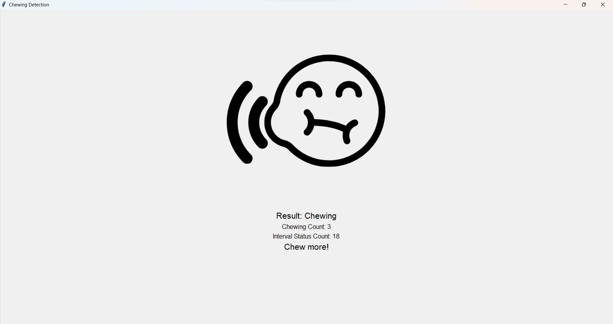

# Habit Counter Project

We have developed a device for tracking healthy eating habits in 3 days at KolpoKoushol Workshop. The device is equipped with sensors to monitor the duration of chewing time between meals. It utilizes machine learning for improved analysis and features an interactive interface and suggestions for visualizing the data. By analyzing the data, the device can categorize eating habits.

During the development process, we encountered technical challenges, especially regarding the hardware and the collection of accurate sensor data. The device can serve multiple purposes. It can be used as a medical device for individuals with food disorders, as well as a parental device. Furthermore, it can be modified to promote healthy eating habits in children.

